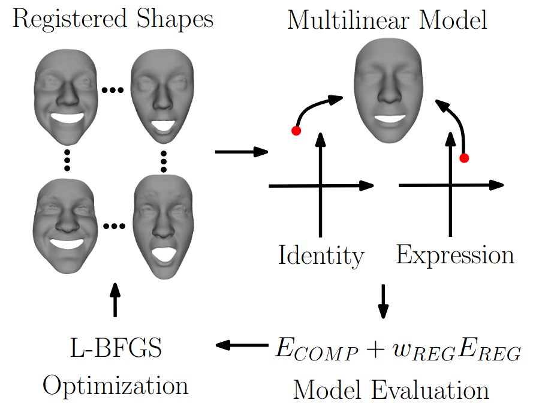

## A Groupwise Multilinear Correspondence Optimization for 3D Faces

The provided program jointly optimizes a multilinear face model and the registration of the face scans used for model training as described in the scientific publication (ICCV 2015) [[paper](https://hal.inria.fr/hal-01205460/document)] [[supplemental](https://hal.inria.fr/hal-01205460/file/Supplemental.pdf)] [[video](https://hal.inria.fr/hal-01205460/file/SupplementaryVideo.avi)].

<p align="center"> 

</p>

### Setup

The provided code has dependencies on the following libraries:
* Insight Segmentation and Registration Toolkit ITK (http://www.itk.org/). We recommend using ITK 4.50.
* Clapack (http://www.netlib.org/clapack/). Clapack must be compiled using Blas (USE BLAS WRAP must be enabled when using CMake). We recommend using Clapac 3.2.1.

To setup the provided code, use CMake and specify the required ITK and Clapack paths. Successfully compiling the project outputs a MM_MDL.exe.

### Basic usage

Given an initially registered 3D face database, MM MDL.exe optimizes the per-vertex correspondence by re-parametrizing each shape. This optimization requires an initial discrete 2D parametrization together with a thin-plate spline that defines a continuous mapping from 2D parameter space to the surface of each face. To compute thin-plates for an initial parametrization, MM MDL.exe must be called with the option −tps, to optimize multilinear correspondence, MM MDL.exe must be called with the option −opt.

##### Parametrization
To compute thin-plates for an initial descrete parametrization, MM MDL.exe must be called with following five parameters, separated by a blank.
* -tps - Option to compute the thin-plate splines.
* dataFolder - Directory that contains the registered data and the file collection (also output folder).
* fileCollection - Container file with the file names of all faces used to learn the multilinear model (file
name only).
* tpsFileCollection - Output container file with the file names of all thin-plate spline files (file name
only).
* textureCoordsFile - File that contains the initial discrete parametrization in the same order as the
vertices of each registered face.

##### Optimization:
To run the multilinear registration optimization, MM MDL.exe must be called with following seven parameters, separated by a blank.
* -opt - Option to compute the multilinear registration optimization.
* dataFolder - Directory that contains the registered data, the thin-plate splines, and the file collections.
* fileCollection - Container file with the file names of all faces used to learn the multilinear model (file
name only).
* tpsFileCollection - Container file with the file names of all thin-plate spline files (file name only).
* outerBoundaryFile - File that contains the vertex indices of the outer boundary vertices.
* innerBoundaryFile - File that contains the vertex indices of the inner boundary vertices.
* outFolder - Output directory

##### File specifications:
The faces need to be provided in an OFF-file format. Let Id i Exp e.off denote the face of identity i in expression e. The fileCollection container for faces of I identities in E expressions is required in following format:
```
E #Expressions
I #Identities
Id 1 Exp 1.off
Id 2 Exp 1.off
.
.
.
Id I Exp 1.off
Id 1 Exp 2.off
.
.
.
Id I Exp 2.off
.
.
.
Id I Exp E.off.
```

##### Example:
The example RunMM_MDL.cmd optimizes the multilinear correspondences for a dataset of four identities in three expressions each. First, RunMM_MDL.cmd computes the thin-plate splines for each face and second, RunMM_MDL.cmd optimizes the correspondence.

##### License
The source is provided for NON-COMMERCIAL RESEARCH PURPOSES only, and is provided as is WITHOUT ANY WARRANTY; without even the implied warranty of fitness for a particular purpose. The redistribution of the code is not permitted.

##### Citing

When using this code in a scientific publication, please cite 
```
@inproceedings{BolkartWuhrer2015_groupwise,
  title = {A groupwise multilinear correspondence optimization for {3D} faces},
  author = {Bolkart, Timo and Wuhrer, Stefanie},
  booktitle = {Proceedings of the IEEE International Conference on Computer Vision (ICCV)},
  pages={3604--3612},
  year={2015}
}
```


